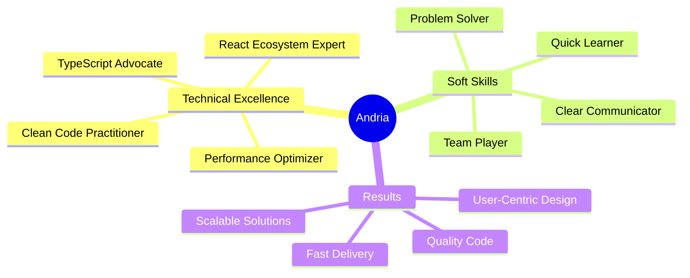

<div align="center">
  
</div>

<div align="center">
  
</div>

<div align="center">
  
  
  
  
</div>

<br/>

<div align="center">
  
</div>

---

## 🎯 **Impact-Driven Developer**

<table>
<tr>
<td width="50%" valign="top">

### 💼 **Professional Snapshot**

```typescript
interface Developer {
  name: string;
  location: string;
  role: string;
  experience: string;
  motto: string;
}

const andria: Developer = {
  name: "Andria Janelidze",
  location: "Tbilisi, Georgia 🇬🇪",
  role: "Frontend Developer",
  experience: "2+ years",
  motto: "Ship fast, optimize faster ⚡"
};

// My superpower? Turning designs into 
// pixel-perfect, performant reality
```

</td>
<td width="50%" valign="top">

### 🏆 **Achievement Highlights**

<div align="center">

| Metric | Achievement |
|--------|-------------|
| 📈 User Engagement | **+45%** |
| ⚡ Load Time | **-60%** |
| 🎨 Client Retention | **+35%** |
| 🌐 User Base Growth | **+25%** |
| 🔧 Debug Efficiency | **+40%** |

</div>

**"Performance isn't just a feature—it's a requirement."**

</td>
</tr>
</table>

---

## 🚀 **Tech Arsenal**

<details open>
<summary><b>🎨 Frontend Core</b></summary>
<br/>

<div align="center">


</div>
</details>

<details open>
<summary><b>⚛️ Frameworks & Libraries</b></summary>
<br/>

<div align="center">


</div>
</details>

<details open>
<summary><b>🎨 Styling & UI</b></summary>
<br/>

<div align="center">


</div>
</details>

<details open>
<summary><b>🔄 State & Data Management</b></summary>
<br/>

<div align="center">


</div>
</details>

<details open>
<summary><b>🛠️ Backend & Tools</b></summary>
<br/>

<div align="center">


</div>
</details>

---

## 💡 **What I Bring to Your Team**

<div align="center">



</div>

<div align="center">
<table>
<tr>
<td width="33%" align="center">


**Logical Thinking** • **Problem-Solving**  
**Debugging Mastery** • **Performance Tuning**  
**API Integration** • **Testing & QA**

</td>
<td width="33%" align="center">


**Team Leadership** • **Client Communication**  
**Agile Methodology** • **Code Reviews**  
**Mentoring** • **Documentation**

</td>
<td width="33%" align="center">


**Growth-Oriented** • **Detail-Focused**  
**Deadline-Driven** • **Innovation Seeker**  
**Continuous Learner** • **Quality Advocate**

</td>
</tr>
</table>
</div>

---

## 📊 **GitHub Analytics**

<div align="center">
  
  
</div>

<div align="center">
  
  
</div>

<div align="center">
  
</div>

---

## 💼 **Professional Journey**

<div align="center">

### **Frontend Developer** • 2+ Years of Excellence

</div>

<table>
<tr>
<td width="50%">

#### 🎯 **Key Responsibilities**

- ⚛️ Architected React applications with TypeScript
- 🎨 Created pixel-perfect, responsive UIs
- 🔌 Integrated RESTful APIs seamlessly
- 🚀 Optimized for performance & SEO
- 👥 Led client requirement sessions
- 📦 Managed version control with Git

</td>
<td width="50%">

#### 🏆 **Notable Achievements**

- ⚡ **60% reduction** in page load times
- 📈 **45% increase** in user engagement
- 🎨 **35% boost** in client retention
- 🌐 **25% growth** in user base
- 🔧 **40% faster** debugging cycles
- ✨ **30% improvement** in satisfaction

</td>
</tr>
</table>

---

## 🎨 **Featured Projects**

<div align="center">

<!-- Uncomment and add your projects -->
<!--
<a href="https://github.com/DAEL64/project-1">
  
</a>
<a href="https://github.com/DAEL64/project-2">
  
</a>
-->

### 🚀 Check out my repositories below to see what I'm building!

</div>

---

## 📬 **Let's Connect & Collaborate**

<div align="center">

[](https://linkedin.com/in/andria-janelidze)
[](https://your-portfolio.com)
[](mailto:andria.janelidze@example.com)
[](https://twitter.com/andriajanelidze)

</div>

<div align="center">
  <br/>
  
</div>

---

<div align="center">

### 💬 **Open to Opportunities**

I'm currently open to freelance projects, contract work, and full-time opportunities.  
Let's build something amazing together! 🚀

</div>

<div align="center">
  
</div>

<div align="center">
  
**⭐ From [DAEL64](https://github.com/DAEL64) • Made with 💙 and lots of ☕**

</div>
